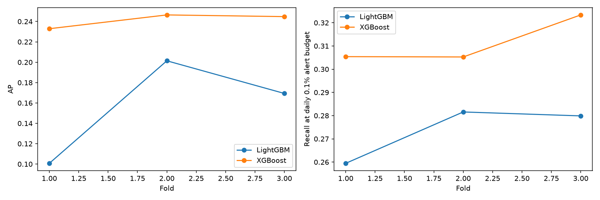

# Результаты временного backtest

**XGBoost лучше LightGBM по AP и recall во всех трёх окнах.**
Проверен сохранённый запуск `20260908T182919Z_7bcadf9cbcb0`; повторного обучения не проводилось.

## Условия

Растущий train; validation и evaluation — по одному дню. Оценка выполнена за 5–7 сентября
2022 года, по 657–659 тыс. транзакций и 368–380 положительных в каждом окне.
Encoder обучается заново внутри fold; параметры моделей фиксированы.
Политика — дневной top-k с бюджетом 0,1% транзакций (657–658 алертов), не online threshold.

## Метрики

| День оценки | AP LightGBM | AP XGBoost | Recall LightGBM | Recall XGBoost |
|---|---:|---:|---:|---:|
| 05.09 | 0,1007 | **0,2329** | 25,95% | **30,54%** |
| 06.09 | 0,2014 | **0,2464** | 28,16% | **30,53%** |
| 07.09 | 0,1693 | **0,2448** | 27,99% | **32,34%** |

| Модель | Средний AP ± std | Средний recall | Средний precision |
|---|---:|---:|---:|
| LightGBM | 0,1572 ± 0,0514 | 27,36% | 15,52% |
| XGBoost | **0,2414 ± 0,0074** | **31,13%** | **17,65%** |

## Выводы

- XGBoost имеет меньший разброс AP и средний выигрыш recall **3,77 п.п.**
  За три дня найдено 348 положительных против 306 у LightGBM при одинаковых 1972 алертах.
- Покрытие остаётся ограниченным: XGBoost пропускает около 69% положительных транзакций.
- Это сравнение фиксированных конфигураций на трёх связанных development-окнах.
  Оно не доказывает универсального превосходства алгоритма и не является новым независимым test.
- С notebook 04 метрики напрямую не сравниваются: отличаются периоды, обучение и политика алертов.
  Предположение OTE о немедленной доступности меток также сохраняется.

Средние рассчитаны по окнам без взвешивания; std — описательный разброс, не доверительный интервал.

[Метрики](fold_metrics.csv) · [Окна](windows.csv) · [Параметры](configuration.json) · [Сводка](summary.csv)
