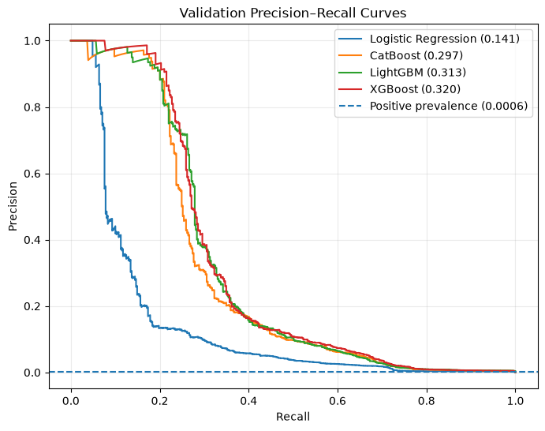
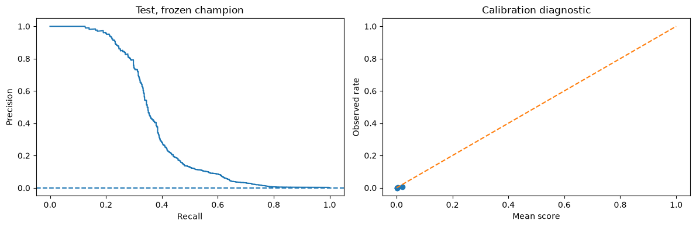

# AML: результаты полного эксперимента

**XGBoost выбран по validation AP = 0,3205. На отложенном test AP = 0,3739.**
При пороге 0,298775 модель отправляет на проверку 355 из 1 039 102 транзакций:
240 истинных и 115 ложных срабатываний. Precision составляет **67,61%**, recall — **31,96%**.
Это исследовательский baseline для приоритизации проверок; он пропускает 511 из 751
положительной транзакции и не обеспечивает полного покрытия отмывания.

Сохранён полный пользовательский запуск `8cb38b1c-cad8-49a9-9eeb-90eb5fd05af0`.
При объединении проекта модели не переобучались для улучшения этих цифр. Метрики повторно
проверены инференсом сохранённого champion на полном test после переноса файлов.
[Проверка переноса](migration_verification.json), [параметры и версии](model_info.json).

## Данные и протокол

Всего 6 924 041 транзакция, 65 подготовленных признаков. Источник запуска — локальный
`data/processed/raw.parquet`; исходный проект использует IBM AML / LI-Small.
Идентичность исходному CSV отдельно не проверялась. Предпочтение Parquet перед CSV сохраняется.

| Период | Строк | Положительных | Доля | Начало | Конец |
|---|---:|---:|---:|---|---|
| Train | 4 846 503 | 2 231 | 0,0460% | 2022-09-01 00:00 | 2022-09-07 14:47 |
| Validation | 692 487 | 409 | 0,0591% | 2022-09-07 14:48 | 2022-09-08 16:05 |
| Threshold | 345 949 | 174 | 0,0503% | 2022-09-08 16:06 | 2022-09-09 03:12 |
| Test | 1 039 102 | 751 | 0,0723% | 2022-09-09 03:13 | 2022-09-17 15:28 |

Доли 70/10/5/15 задаются по числу строк, границы сдвинуты к началу timestamp-пакета.
Одинаковое время не разделяется между периодами. Исторические признаки используют строго
прошлые события без их меток; OTE для будущих периодов заморожен на train.
Модель выбирается по validation; порог максимального F1 — по отдельному threshold-периоду.
Test используется для оценки одной выбранной модели.

В notebook 03 сохранены все 2 231 положительная строка и 39% отрицательных:
1 891 497 строк для fit. Отрицательные примеры получают обратный вес вероятности отбора
около 2,5641. Validation, threshold и test не подвергались такому undersampling.

## Сравнение представлений

| CatBoost, одинаковые sampled rows и веса | Validation AP | ROC-AUC |
|---|---:|---:|
| Native categorical | 0,263961 | 0,976843 |
| Ordered target encoding | **0,296390** | 0,975759 |

OTE даёт +0,03243 AP, или примерно +12,3% относительно native в этом конкретном сравнении.
ROC-AUC немного ниже: две метрики ранжирования не обязаны двигаться одинаково.
Это не доказательство превосходства на всех временных периодах.

Сравнение в 02 использовало 30% отрицательных и отдельный encoder. Для 03 encoder построен
на полном train, а модель обучается на другой подвыборке (39%). Поэтому цифры 02 и 03
нельзя трактовать как чистую абляцию только алгоритма модели.
[Исходная таблица](encoding_comparison.csv).

## Выбор модели по validation

| Модель | AP | ROC-AUC |
|---|---:|---:|
| **XGBoost** | **0,320489** | 0,977253 |
| LightGBM | 0,313478 | **0,978847** |
| CatBoost | 0,296989 | 0,976379 |
| Logistic Regression | 0,140662 | 0,950594 |

Проведён поиск Optuna: 20 trials CatBoost, 30 LightGBM, 20 XGBoost по конфигурации notebook.
Логистическая регрессия — baseline с фиксированными параметрами.
XGBoost опережает LightGBM всего на 0,00701 AP; при 409 положительных примерах на validation
без повторных временных экспериментов нельзя утверждать, что преимущество устойчиво.

У сохранённого XGBoost `best_iteration=77`: sklearn-инференс использует первые 78 деревьев.
Бюджет был 1200 деревьев, patience ранней остановки — 100.
Learning rate 0,05808, max depth 8, scale_pos_weight 1,53924.
Полные параметры сохранены в [model_info.json](model_info.json).

[Исходная таблица сравнения](validation_metrics.csv).
AP здесь — sklearn average precision. Нативные CatBoost PRAUC и XGBoost aucpr для ранней
остановки не отождествляются с этой метрикой.

## Отложенный test и выбранный порог

| Метрика | Значение |
|---|---:|
| AP | 0,373919 |
| ROC-AUC | 0,962133 |
| Precision | 67,61% |
| Recall | 31,96% |
| F1 | 0,433996 |
| Доля алертов | 0,03416% |
| Доля положительных | 0,07227% |
| Brier score | 0,00057106 |
| Порог score | 0,298775 |

| Фактический класс | Нет алерта | Алерт |
|---|---:|---:|
| 0 | 1 038 236 | 115 |
| 1 | 511 | 240 |

Модель создаёт около **3,42 алерта на 10 000 транзакций** при текущем пороге.
Из 355 алертов 240 полезны, но пропущены 68,04% положительных транзакций.
F1-порог не оптимизирует заранее согласованную стоимость ошибок или пропускную способность
команды расследований. Порог нельзя менять по этим test-результатам и затем считать этот
же test независимой проверкой новой политики.

Test AP выше validation на 0,05343, одновременно ROC-AUC ниже. Доля положительных выросла
с 0,0591% до 0,0723%, а состав и длина периодов отличаются. AP зависит от prevalence;
рост AP сам по себе не доказывает улучшение обобщения или отсутствие drift.

Низкий Brier частично обусловлен редкостью положительного класса. Для ориентира у прогноза
«всегда 0» Brier равен prevalence, около 0,00072274; у модели он ниже.
Но это не доказывает хорошую калибровку в диапазоне высоких scores. Class weights и target
encoding требуют отдельной проверки калибровки; текущая calibration curve — только диагностика. Квантильные бины в основном содержат
низкие scores и плохо показывают редкий хвост высоких оценок.

[Метрики](test_metrics.csv), [зафиксированный порог](threshold.json).

## Drift: что действительно видно

Восемь из 65 признаков имеют PSI ≥ 0,2 в сохранённом отчёте validation → test.

| Признак | PSI | Интерпретация |
|---|---:|---|
| dow_sin | 23,504 | Validation содержит узкую часть недели; test — более недели |
| day | 4,932 | Разные календарные даты по определению temporal split |
| is_weekend | 3,583 | В коротком reference нет выходных |
| dayofweek | 3,467 | Разный охват дней недели |
| pair_prev_tx_log | 1,824 | Распределение накопленной истории пар меняется со временем |
| sender_prev_tx_log | 0,402 | История отправителей накапливается |
| receiver_prev_tx_log | 0,305 | История получателей накапливается |
| sender_minutes_since_prev_log | 0,219 | Меняется распределение интервалов активности |

У денежных сумм PSI около 0,0017; в подготовленных числовых признаках нет пропусков.
Для кумулятивной истории сдвиг ожидаем даже при стабильном потоке. Для календарных признаков
сравниваются периоды разной длины и разного покрытия недели. Поэтому нельзя объявлять эти
восемь сигналов восемью доказанными проблемами качества.

PSI чувствителен к бинам и почти пустым категориям; порог 0,2 — эвристика для расследования.
Следующий мониторинг стоит строить на сопоставимых окнах и проверять качество после созревания
меток. Текущий отчёт не тестирует concept drift и не заменяет мониторинг raw-категорий.
[Полная таблица PSI](drift.csv).

## Выводы и следующие эксперименты

1. Бустинги заметно сильнее Logistic Regression на этом validation. XGBoost — выбранный
   champion, но разрыв с LightGBM мал; нужна оценка на нескольких будущих временных окнах.
2. Система пригодна как исследовательская модель приоритизации. Recall около 32% слишком
   мал для утверждения, что модель покрывает все положительные транзакции.
3. Критичное допущение — немедленная доступность меток для OTE. В данных нет timestamp
   окончания расследования. Для реального применения нужен encoder с учётом времени
   доступности метки либо модель без target encoding.
4. Следует заранее определить бюджет алертов и стоимость пропуска, затем выбрать новую
   политику на development-периодах и оценить её на **новом** holdout.
5. Устойчивость проверять rolling backtest с сопоставимыми временными окнами. Нынешний test
   уже просмотрен; он остаётся зафиксированным результатом этого эксперимента.
6. Raw online inference ещё не реализован: joblib модели и encoder не включают хранилище
   исторических событий. Также предполагается доступность полей получения платежа при скоринге.

## Сохранность результатов

В основных notebooks сохранены outputs полного запуска, включая графики. Перенос изменил
импорты, пути и выбор smoke/full, но не значения сохранённых результатов. Удалены только
устаревшие интерактивные progress widgets. CSV/JSON и PNG этого отчёта не зависят от локальных
joblib/Parquet и доступны после клонирования репозитория.

[Хэши notebooks до переноса](source_notebooks_sha256.json) фиксируют источник outputs.
Локальные исходные версии находятся в `artifacts/archive`, веса и splits — в
`artifacts/runs/full`; оба пути исключены из Git. Git-история хранит ранее отслеживаемые исходники.

## Дополнение: ошибки сохранённого XGBoost по сегментам

Диагностика выполнена на том же test с неизменным порогом 0,298775.
Все **355 алертов относятся к ACH**. В ACH найдены 240 из 596 положительных: recall 40,27%.
За пределами ACH пропущены все 155 положительных транзакций:
Cheque — 80, Credit Card — 42, Bitcoin — 18, Cash — 15.
Это ограничение выбранной модели вместе с текущим порогом, а не доказательство отсутствия
сигнала в других форматах. Новая модель/политика требует нового holdout.

Для новых получателей (пара банк–счёт отсутствовала в train в обеих ролях)
найден 1 из 12 положительных; для новых отправителей — 6 из 20.
Размеры этих групп малы: выводы о сравнении новых и известных счетов неустойчивы.
В US Dollar пропущено 208 из 335 положительных, в Euro — 135 из 231;
вместе это 343 из 511 пропусков. Приведены абсолютные числа, а не причинная важность валюты.

Таблицы с объёмом групп, TP/FP/FN, precision, recall и долей алертов:

- [Форматы платежа](error_analysis/Payment_Format_errors.csv)
- [Валюты](error_analysis/Payment_Currency_errors.csv)
- [Дни](error_analysis/day_errors.csv) и [часы](error_analysis/hour_errors.csv)
- [Отправители](error_analysis/sender_status_errors.csv)
- [Получатели](error_analysis/receiver_status_errors.csv)

NaN в precision означает отсутствие алертов; NaN в recall — отсутствие положительных.
